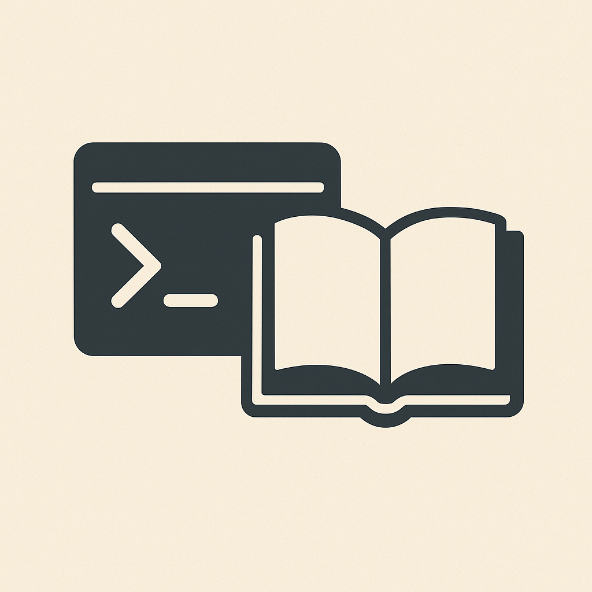
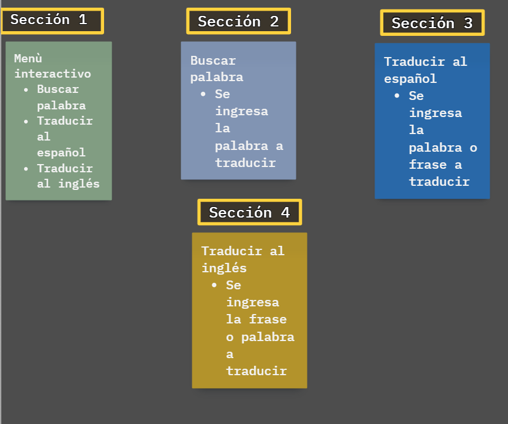
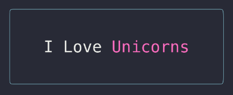

# DICXY: Diccionario traductorio multilenguaje 📖

**El superdiccionario en consola**

Las personas, en su día a día, suelen enfrentarse a situaciones en las que necesitan resolver dudas rápidas sobre el lenguaje.
Por ejemplo:

Conocer la definición exacta de una palabra, ya sea para comprender mejor un texto, enriquecer su vocabulario o asegurarse de usar el término correcto en un contexto determinado.

Traducir de manera inmediata una palabra o frase a otro idioma —como del inglés al español o viceversa—, sin tener que abrir traductores online, aplicaciones externas o páginas adicionales.

El problema surge cuando para cumplir estas tareas deben alternar entre diferentes aplicaciones, sitios web o incluso diccionarios físicos, lo que implica pérdida de tiempo y una experiencia fragmentada.

La solución propuesta es una aplicación de consola todo en uno, que integra en un solo lugar la búsqueda de definiciones y la traducción rápida. De esta forma, el usuario no necesita saltar entre múltiples herramientas: todo se resuelve directamente desde la terminal con comandos simples, rápidos y eficientes.

## Secciones planeadas

## Librerias a utilizar 📚

A continuación, se describen las principales librerías que hicieron posible la implementación del aplicativo.

### Diseño estético ✨

#### Boxen 🧰

`boxen` es un paquete para Node.js que permite crear cajas de texto estilizadas en la terminal, facilitando la presentación visual de mensajes dentro de un entorno de consola. Es una herramienta práctica y versátil para mejorar la experiencia visual de las aplicaciones terminales en JavaScript, con gran flexibilidad y sencillez de uso.

**¿Por qué se utiliza?**

El motivo de uso de la libreria `boxen` es con fines estéticos, este tipo de libreria no tiene algun comportamiento sobre las funciones claves del aplicativo, como fue mencionado 