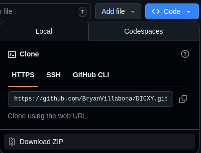
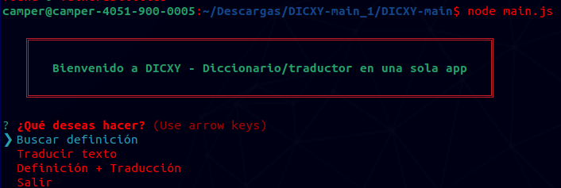

# DICXY: Diccionario traductorio multilenguaje 📖

**El superdiccionario en consola**

Las personas, en su día a día, suelen enfrentarse a situaciones en las que necesitan resolver dudas rápidas sobre el lenguaje.
Por ejemplo:

Conocer la definición exacta de una palabra, ya sea para comprender mejor un texto, enriquecer su vocabulario o asegurarse de usar el término correcto en un contexto determinado.

Traducir de manera inmediata una palabra o frase a otro idioma —como del inglés al español o viceversa—, sin tener que abrir traductores online, aplicaciones externas o páginas adicionales.

El problema surge cuando para cumplir estas tareas deben alternar entre diferentes aplicaciones, sitios web o incluso diccionarios físicos, lo que implica pérdida de tiempo y una experiencia fragmentada.

La solución propuesta es una aplicación de consola todo en uno, que integra en un solo lugar la búsqueda de definiciones y la traducción rápida. De esta forma, el usuario no necesita saltar entre múltiples herramientas: todo se resuelve directamente desde la terminal con comandos simples, rápidos y eficientes.

## Secciones planeadas

## Librerias a utilizar 📚

A continuación, se describen las principales librerías que hicieron posible la implementación del aplicativo.

### Diseño estético ✨

#### Boxen 🧰

`boxen` es un paquete para Node.js que permite crear cajas de texto estilizadas en la terminal, facilitando la presentación visual de mensajes dentro de un entorno de consola. Es una herramienta práctica y versátil para mejorar la experiencia visual de las aplicaciones terminales en JavaScript, con gran flexibilidad y sencillez de uso.

**¿Por qué se utiliza?**

El uso de la librería boxen se limita a fines estéticos, ya que su función principal es mejorar la presentación visual en la consola. Esta librería no interviene ni afecta el comportamiento de las funcionalidades clave del aplicativo, como se mencionó anteriormente.

#### Chalk 🖌️

`chalk` es una librería de Node.js que permite aplicar colores y estilos al texto en la terminal, facilitando la creación de salidas más legibles y atractivas en aplicaciones de consola. Soporta colores básicos, 256-colores y Truecolor, además de formatos como negrita, subrayado o fondos personalizados.

**¿Por qué se utiliza?**

Su uso tiene un fin principalmente estético: ofrecer una experiencia más agradable al usuario mediante colores y estilos visuales en la consola, evitando así la apariencia monótona y tradicional de las interfaces de línea de comandos.

### Funcionalidades 🛞

#### Inquirer 📲

`Inquirer` es una poderosa librería de Node.js que facilita la creación de interfaces interactivas en la terminal. Permite realizar fácilmente preguntas al usuario con distintos formatos de entrada —como selección de lista, confirmaciones, texto libre, entre otros—, e incluye funcionalidades útiles como validación de respuestas, manejo de errores y flujos de preguntas jerárquicas.

**¿Por qué se utiliza?**

Es fundamental en secciones como el menú, la elección de idioma o la selección de clases gramaticales. Actúa como el principal intermediario para recopilar las opciones elegidas por el usuario, las cuales posteriormente son procesadas para sus respectivos usos.

#### natural y wornet-db 🆎

`natural` es una librería de procesamiento de lenguaje natural para Node.js que permite, entre muchas otras funciones, buscar definiciones y sinónimos a través de la integración con WordNet. Por su parte, `wordnet-db` proporciona los archivos de base de datos de WordNet necesarios para alimentar esa integración. Juntas, permiten consultar fácilmente el diccionario léxico de WordNet desde tu aplicación."

**¿Por qué se utilizan?**

Permiten administrar los significados y busqueda de conceptos que el usuario requiera mediante solicitudes.

Estas dos librerias deben trabajar juntas debido a que:

La librería natural incluye la lógica para trabajar con WordNet (consultar definiciones, sinónimos, relaciones léxicas, etc.), pero no trae incorporada la base de datos de WordNet porque los archivos de WordNet son muy grandes y pesados, y se actualizan de forma independiente.

#### translate 🈳

La librería `translate` es una herramienta versátil para Node.js y el navegador que permite convertir texto entre diferentes idiomas de manera sencilla.

**¿Por qué se utiliza?**

Se utiliza para traducir el texto ingresado por el usuario al idioma deseado.

## Instrucciones de instalación

A continuación, se detallan los pasos para descargar, instalar y utilizar el programa **DICXY**.

**1. Ir al repositorio oficial de DICXY**

- Para obetener los archivos rapidamente se puede optar por dar click en `Download ZIP`

- Despues de haber realizado la descarga del .ZIP se debe abrir el administrador de archivos para descomprimir el archivo.

**2. Descomprimir el archivo .ZIP**

- Al descomprimirlo se obtiene una carpeta como esta:

  

**3. Ejecutar comandos**

- Se ejecuta el comando `npm i` para cargar los archivos necesarios para el funcionamiento de DICXY

- Luego se ejecuta `node main.js` para iniciar el programa

